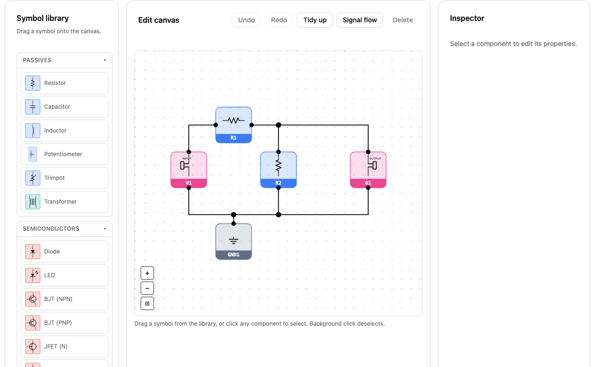

# @vessel-dsp/react-pedal-schematic

[](https://www.npmjs.com/package/@vessel-dsp/react-pedal-schematic)

React circuit-schematic tooling for guitar pedals and nearby audio electronics. The library renders a stylable SVG schematic preview, and also includes format-aware parsing, validation, inspection, light editing, and export helpers.

The project is pedal-first, but the model and fixtures also cover nearby audio-circuit schematics such as amp stages, tone filters, and utility circuits.



## Install

```bash
npm install @vessel-dsp/react-pedal-schematic
```

React apps can import the UI component and document helpers from the package root:

```ts
import { parseCircuitDocument, validateDocument } from '@vessel-dsp/react-pedal-schematic';
import { SchematicView } from '@vessel-dsp/react-pedal-schematic';
```

Headless consumers can avoid the React entrypoint:

```ts
import { parseCircuitDocument, validateDocument } from '@vessel-dsp/react-pedal-schematic/core';
```

## Supported Inputs

- Project-native `.vdsp` Source documents (`circuit-interchange/v1` YAML)
- LiveSPICE `.schx`
- LTspice `.asc`
- SPICE-style `.cir` / `.net`

Use the source-format dispatcher for `.schx`, `.asc`, `.cir`, and `.net` consumer integrations:

```ts
import { parseCircuitDocument } from '@vessel-dsp/react-pedal-schematic/core';

const document = parseCircuitDocument(sourceText, {
    filename: 'pedal.asc',
});
```

Use `parseCircuitDocumentFile()` when accepting project-native `.vdsp` Source files as well as source schematics:

```ts
import { parseCircuitDocumentFile, serializeVdspCircuitDocument } from '@vessel-dsp/react-pedal-schematic/core';

const document = parseCircuitDocumentFile(sourceText, {
    filename: 'pedal.vdsp',
});

const vdspSource = serializeVdspCircuitDocument(document);
```

The full public API is documented in [API.md](./API.md). Format conversion is documented in [DOCUMENT.md](./DOCUMENT.md#format-conversion). It is semantic through `CircuitDocument`, not byte-for-byte source regeneration.
Use `parseVdspCircuitDocument()` for strict `.vdsp` parsing and `validateVdspCircuitDocumentSchema()` when you need non-throwing file-schema validation. `.vdsp` also supports optional stompbox panel grid metadata for knob, switch, slider, LED, and jack placement, plus `controlInterfaces` metadata for external trigger/reset, tempo-tap, and expression-style inputs; see the examples in [DOCUMENT.md](./DOCUMENT.md#format-conversion).

## React Preview

```tsx
import { useState } from 'react';
import { SchematicView, type WireFlowMode } from '@vessel-dsp/react-pedal-schematic';
import type { CircuitDocument } from '@vessel-dsp/react-pedal-schematic/core';

export function CircuitPreview(props: { document: CircuitDocument }) {
    const [wireFlow, setWireFlow] = useState<WireFlowMode>('none');

    return (
        <>
            <button
                type="button"
                aria-pressed={wireFlow === 'all'}
                onClick={() => setWireFlow((mode) => mode === 'all' ? 'none' : 'all')}
            >
                Signal flow
            </button>
            <SchematicView document={props.document} wireFlow={wireFlow} />
        </>
    );
}
```

`wireFlow="all"` is a visual overlay only. It dims the base wires to light gray and animates light-blue dashes along wires so users can trace connectivity; it does not claim simulated current direction. Override the colors with `--cpe-wire-flow-base` and `--cpe-wire-flow` on the `SchematicView` host element.

## Development

```bash
bun install
bun test
bun run typecheck
bun run build
npm pack --dry-run
bun run build:playground
bun run dev
```

## License

MIT License. See [LICENSE.md](./LICENSE.md).

More integration notes and a full example live in [DOCUMENT.md](./DOCUMENT.md) and [examples/schematic-flow-toggle.tsx](./examples/schematic-flow-toggle.tsx).
